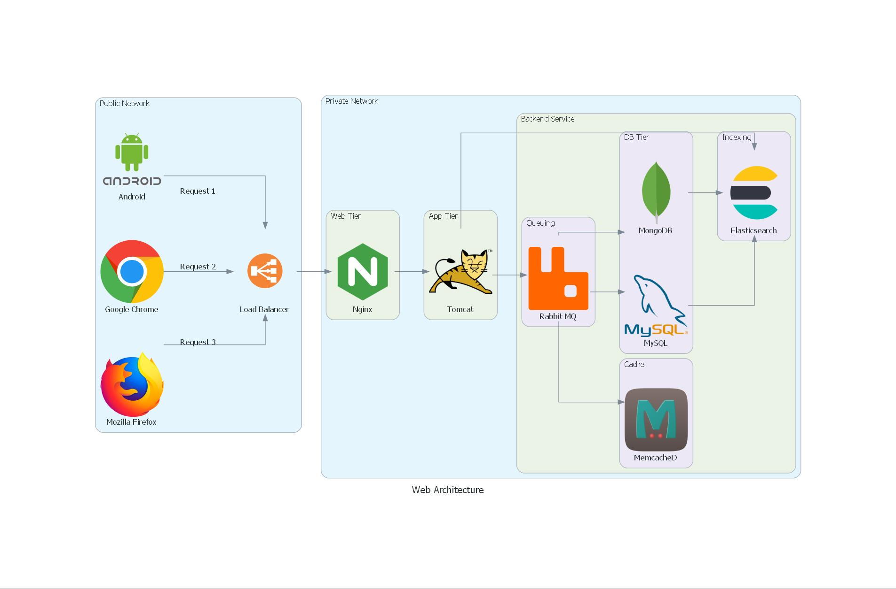

# Diagram as a Code

## Diagram 3 : Custom & On-Prem diagram

In this step, we will go with the **Custom and On-Prem tools**, where we will generate (code) an image file with the image name as **custom_diagram.jpg**.

The file will be located in the current working directory.

Note: In order to use Custom resources, we need to have the respective icons in a local or remote directory. In our case, the custom resources are present in the directory called *my_resources*.

The files and artifacts are present in this [GitHub Repo](https://github.com/SanthoshNC/Diagram-as-a-Code/tree/master/3_custom_diagram).

### Step 1 : Write the code

Kindly create a file with using any of the file editor (say vi, nano gedit, etc.,) and enter the below contents and save the file with a name (In our case, its **3_custom_diagram.py**)

Key Take-away from this code:

- **direction=”LR”** – Used to define the direction of the diagram (in our case, it is Left to Right)
- **with Cluster** – Used to create a cluster in a diagram (In our case, we have Public and Private Clusters)
- **Custom(“Android”, “./my_resources/android.png”)** – Used to import custom resources in a diagram

### Step 2 : Execute the file

Kindly execute the file with the below mentioned commands to generate and list the diagram.

### Step 3 : View the file using an image viewer

Kindly execute the below command to view the generated image from the terminal.

