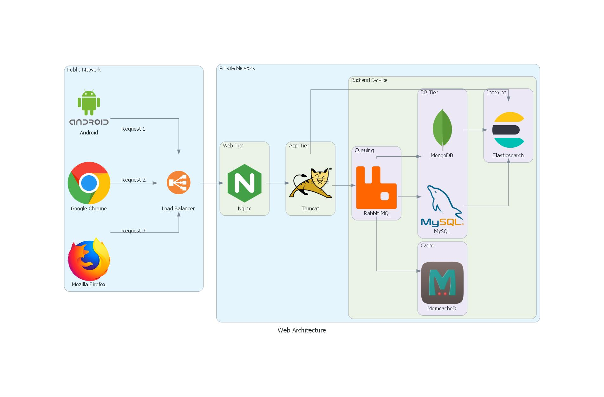

# Diagram as a Code

## Diagram 3 : Custom & On-Prem diagram

In this step, we will go with the **Custom and On-Prem tools**, where we will generate (code) an image file with the image name as **custom_diagram.jpg**.

The file will be located in the current working directory.

Note: In order to use Custom resources, we need to have the respective icons in a local or remote directory. In our case, the custom resources are present in the directory called *my_resources*.

The files and artifacts are present in this [GitHub Repo](https://github.com/SanthoshNC/Diagram-as-a-Code/tree/master/3_custom_diagram).

### Step 1 : Write the code

Kindly create a file with using any of the file editor (say vi, nano gedit, etc.,) and enter the below contents and save the file with a name (In our case, its **3_custom_diagram.py**)

```python
from diagrams import Diagram, Cluster, Edge
from diagrams.custom import Custom
from diagrams.onprem.network import Nginx
from diagrams.onprem.network import Tomcat
from diagrams.onprem.inmemory import Memcached
from diagrams.onprem.queue import Rabbitmq
from diagrams.onprem.database import Mongodb
from diagrams.onprem.database import Mysql
from diagrams.elastic.elasticsearch import Elasticsearch

with Diagram("Web Architecture", show=False, outformat="jpg", filename="custom_diagram", direction="LR"):
  
  with Cluster("Public Network"):
     android = Custom("Android", "./my_resources/android.png")
     chrome = Custom("Google Chrome", "./my_resources/chrome.png")
     firefox = Custom("Mozilla Firefox", "./my_resources/firefox.png")
     loadbalancer = Custom("Load Balancer", "./my_resources/loadbalancer.png")
                 
  android >> Edge(label = "Request 1") >> loadbalancer
  chrome >> Edge(label = "Request 2") >> loadbalancer
  firefox >> Edge(label = "Request 3") >> loadbalancer
  
  with Cluster("Private Network"):
     with Cluster("Web Tier"):
        nginx_cluster = Nginx("Nginx")
     with Cluster("App Tier"):
        tomcat_cluster = Tomcat("Tomcat")
     with Cluster("Backend Service"):
        with Cluster("Queuing"):
            rabbitmq = Rabbitmq("Rabbit MQ")
        with Cluster("Cache"):
            memcached = Memcached("MemcacheD")
        with Cluster("DB Tier"):
            db_cluster = [Mysql("MySQL"),Mongodb("MongoDB")]
        with Cluster("Indexing"):
            elasticsearch = Elasticsearch("Elasticsearch")
        
  loadbalancer >> nginx_cluster >> tomcat_cluster >> rabbitmq >> memcached
  rabbitmq >> db_cluster
  db_cluster >> elasticsearch
  tomcat_cluster >> elasticsearch
```

Key Take-away from this code:

- **direction=”LR”** – Used to define the direction of the diagram (in our case, it is Left to Right)
- **with Cluster** – Used to create a cluster in a diagram (In our case, we have Public and Private Clusters)
- **Custom(“Android”, “./my_resources/android.png”)** – Used to import custom resources in a diagram


### Step 2 : Execute the file

Kindly execute the file with the below mentioned commands to generate and list the diagram.

```shell
python3 3_custom_diagram.py # To run the file to generate diagram
ls -lrt # To check the files. A file called custom_diagram.jpg will be generated in the directory
```

### Step 3 : View the file using an image viewer

Kindly execute the below command to view the generated image from the terminal.

```shell
xdg-open custom_diagram.jpg # Opens the generated diagram in default image viewver.
```


